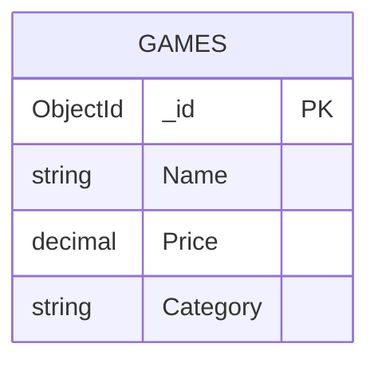

# EDD.md

Entity Document Diagram for `mongodb-dotnet-example`.

## Metadata

- Database: `GamesDB`
- Primary Collection: `Games`
- Source of truth in code: `Models/Game.cs`, `Services/GamesService.cs`

## Entity: Game

Collection: `Games`

### Fields

| Field | BSON Type | C# Type | Required | Notes |
|---|---|---|---|---|
| `_id` | `ObjectId` | `string` (`[BsonRepresentation(ObjectId)]`) | Yes | MongoDB primary key |
| `Name` | `String` | `string` | Yes | Serialized with `[BsonElement("Name")]` |
| `Price` | `Decimal128` or numeric-compatible | `decimal` | Yes | Monetary value |
| `Category` | `String` | `string` | Yes | Game genre/category |

### Indexes

- Default unique index on `_id`
- No additional secondary indexes are defined by application code

### Validation And Constraints

- Route constraints require `id` values to have length 24 for get/update/delete endpoints
- No MongoDB schema validator is currently configured in code

### Seed Behavior

- On API startup, if `StartupBehaviorSettings:SeedOnStartup` is `true`, the app checks collection emptiness
- If empty, inserts default records from `Models/GameSeedData.cs`
- Seed operation is idempotent by emptiness guard

## Relationships

- `Game` has no document references in current data model
- Single-collection design

## Mermaid Diagram

