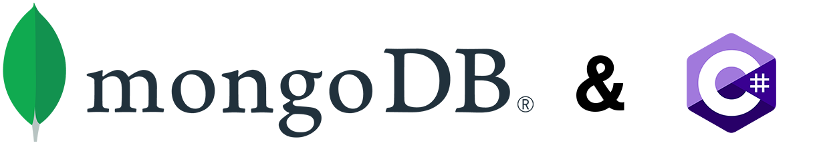
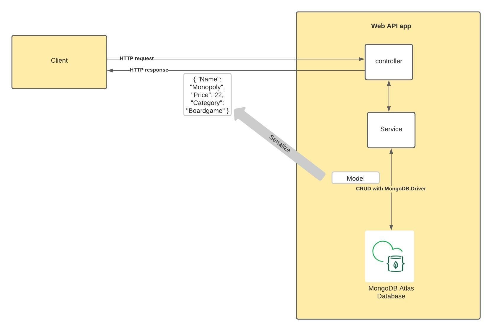

## Introduction
Welcome to this MongoDB and ASP.Net Core Web API sample project. 
The aim of this project is to give you a working example of how you can use the power of MongoDB Atlas and .NET to create modern applications.
This project is intended to be a companion project to the article [How to use MongoDB Atlas with .NET/.NET Core](https://www.mongodb.com/languages/how-to-use-mongodb-with-dotnet) from the MongoDB website.

## Getting Started

1. Clone this repo to your local machine
2. Open the project in your IDE of choice
3. Edit appsettings.json and appsettings.Development.json and  update the ConnectionString field with your connection string from the 'Connect' button for your cluster in the [Atlas UI](https://cloud.mongodb.com) 
4. Run the project to allow you access to the endpoints for all CRUD operations.

## Getting to know the code

The below diagram shows the overall architecture of the application and the following sections will explain the code more.



### Controllers

The GamesController.cs class is where the routes/endpoints for the api are defined. 

Each endpoint calls to a method in the GamesService.cs class.

### Services

The GamesService.cs class contains the code that uses the MongoDB.Driver NuGet package to carry out CRUD operations against your Cluster.

### Models

The Game.cs class acts as a model you can use throughout the project and the properties in it, map to the fields in the MongoDB document.

GamesDatabaseSettings.cs contains an interface and implementation that maps to the GamesDatabaseSettings section in appsettings.json and appsettings.Development.json. In this application, the connection string to your cluster is stored here, but normally in production, you would combine this with [user secrets](https://docs.microsoft.com/en-us/aspnet/core/security/app-secrets?view=aspnetcore-5.0&tabs=windows).

### Project Root

At the root of the project is the usual files that come out of the box with an ASP.NET Core Web API project. 

The only file with changes made here is the Startup.cs class. Inside the ConfigureServices method, the appsettings code is pulled in and the Database settings and Games Service are added to dependency injection for use in other classes.

## Running the code

If your IDE supports it, you can go ahead and run the application from inside the IDE.

If you prefer to run it from your terminal/command-line, you can use ``` dotnet run ```.

## More information

If you want more information about MongoDB and Atlas, the powerful cloud-based database solution, you can view [the documentation](https://docs.atlas.mongodb.com/).

## Disclaimer 

Use at your own risk; not a supported MongoDB product 
