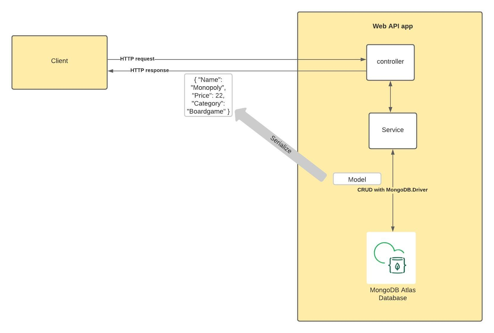

# MongoDB Games API with ASP.NET Core

This repository is a minimal .NET Web API that demonstrates CRUD operations against MongoDB for a `games` domain model.
It is designed for developers learning how to connect ASP.NET Core services to MongoDB Atlas or a local MongoDB instance.

[](https://codespaces.new/mongodb-developer/mongodb-dotnet-example)

## Features

- ASP.NET Core Web API with Swagger UI
- MongoDB .NET Driver integration through a dedicated service layer
- CRUD endpoints for a `Game` entity
- Startup seed behavior that inserts sample games when the collection is empty
- Dev Container support with MongoDB Atlas Local for fast onboarding
- GitHub Actions CI with a local MongoDB service container

## Architecture Overview

The API receives HTTP requests in `GamesController`, delegates data operations to `GamesService`, and persists documents in MongoDB.



## Tech Stack

- .NET 10 Web API
- MongoDB .NET Driver (`MongoDB.Driver`)
- Swagger / OpenAPI (`Swashbuckle.AspNetCore`)
- MongoDB Atlas Local (dev container), `mongo:latest` (CI)

## Prerequisites

- .NET SDK 10+
- Docker 24+ (for local MongoDB or dev container workflows)
- Optional: MongoDB Atlas cluster connection string

## Quick Start (Local)

1. Start MongoDB locally (Docker example):

```bash
docker run --rm -d --name mongo-local -p 27017:27017 mongo:latest
```

2. Restore and run the API:

```bash
dotnet restore
dotnet run --urls http://localhost:5000
```

3. Verify service health and seeded data:

```bash
curl http://localhost:5000/health
curl http://localhost:5000/api/games
```

4. Open the API documentation UI:

```text
http://localhost:5000/swagger/index.html
```

Expected outcomes:
- Health endpoint returns `Healthy`
- `GET /api/games` returns a JSON array containing sample records (for example `Celeste`, `Hades`)

## Run in Codespaces / Dev Container

1. Open the repository in GitHub Codespaces (badge above) or VS Code Dev Containers.
2. Wait for container setup to complete (`dotnet restore` runs automatically).
3. Run the API:

```bash
dotnet run --urls http://0.0.0.0:5000
```

4. Open:
- Swagger UI: `http://localhost:5000/swagger/index.html`
- Health endpoint: `http://localhost:5000/health`

## App Settings

Application behavior is configured through `appsettings.json` and `appsettings.Development.json`.

| Section | Key | Default | Description |
|---|---|---|---|
| `GamesDatabaseSettings` | `ConnectionString` | `mongodb://localhost:27017` | MongoDB connection string |
| `GamesDatabaseSettings` | `DatabaseName` | `GamesDB` | MongoDB database name |
| `GamesDatabaseSettings` | `GamesCollectionName` | `Games` | MongoDB collection name |
| `StartupBehaviorSettings` | `SeedOnStartup` | `true` | Inserts default games when collection is empty |

Environment variables are still supported as optional ASP.NET Core overrides (for example in CI/CD), but the app no longer depends on direct environment-variable reads.

## MongoDB Features Demonstrated

- MongoDB document mapping with BSON attributes (`Game` model)
- Collection-level CRUD operations (`Find`, `InsertOne`, `ReplaceOne`, `DeleteOne`)
- Configuration-driven database and collection selection
- Standardized MongoDB client `appName` for telemetry/observability

Relevant docs:
- [MongoDB .NET/C# Driver](https://www.mongodb.com/docs/drivers/csharp/)
- [MongoDB Atlas](https://www.mongodb.com/docs/atlas/)

## API Overview

| Method | Path | Purpose |
|---|---|---|
| `GET` | `/api/games` | List all games |
| `GET` | `/api/games/{id}` | Get one game by ObjectId |
| `POST` | `/api/games` | Create a game |
| `PUT` | `/api/games/{id}` | Replace an existing game |
| `DELETE` | `/api/games/{id}` | Delete a game |
| `GET` | `/health` | Health check endpoint |

## Project Structure

- `Controllers/GamesController.cs`: API routes and HTTP responses
- `Services/GamesService.cs`: MongoDB data access and seed helper
- `Models/Game.cs`: Document model
- `Models/GamesDatabaseSettings.cs`: Configuration contracts
- `Models/GameSeedData.cs`: Default seed dataset
- `.devcontainer/`: Dev Container and Atlas Local configuration
- `.github/workflows/ci.yml`: CI build and smoke/integration checks
- `EDD.md`: MongoDB entity and index contract

## Testing and CI

CI runs on GitHub Actions and performs:
- `dotnet test tests/MongodbDotnetExample.Tests/MongodbDotnetExample.Tests.csproj`
- `dotnet restore`
- `dotnet build`
- API startup + health check
- CRUD smoke check against a local MongoDB service container

Run locally:

```bash
dotnet test tests/MongodbDotnetExample.Tests/MongodbDotnetExample.Tests.csproj
dotnet build
```

## Troubleshooting

1. API starts but requests fail with MongoDB connection errors:
- Ensure MongoDB is running and reachable at `GamesDatabaseSettings:ConnectionString` in app settings.

2. Port binding errors on `5000`:
- Run with a different port: `dotnet run --urls http://localhost:5050`.

3. Empty response from `/api/games` after first run:
- Confirm `StartupBehaviorSettings:SeedOnStartup` is `true`.

4. Dev container builds but API cannot reach MongoDB:
- In shared network mode, use `mongodb://localhost:27017` (not `mongodb://mongodb:27017`).

5. Swagger does not load:
- Check `/health` first; if healthy, verify `http://localhost:5000/swagger` and inspect server logs.

## Additional Resources

- [How to use MongoDB Atlas with .NET/.NET Core](https://www.mongodb.com/languages/how-to-use-mongodb-with-dotnet)
- [MongoDB C# Driver CRUD Quick Reference](https://www.mongodb.com/docs/drivers/csharp/current/fundamentals/crud/)

## License

This project is licensed under the terms in [LICENSE](./LICENSE).
